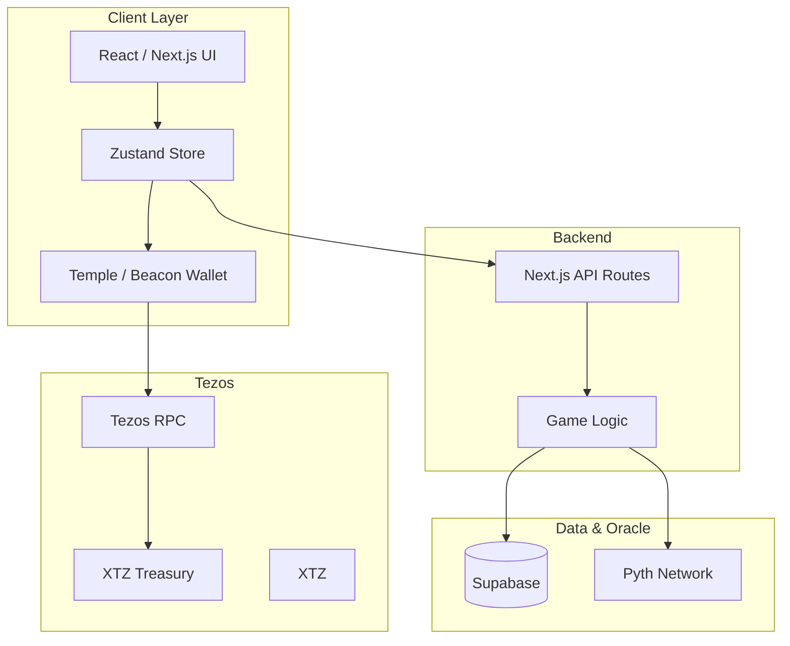
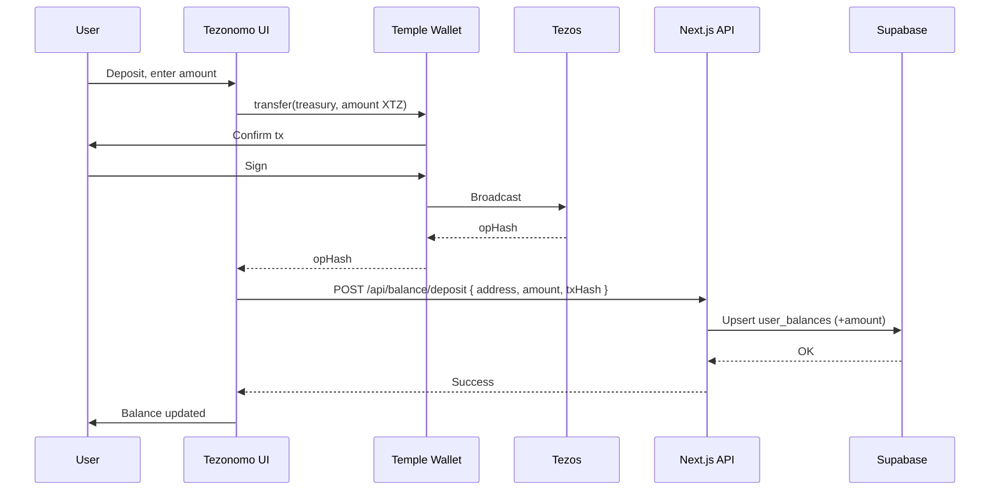
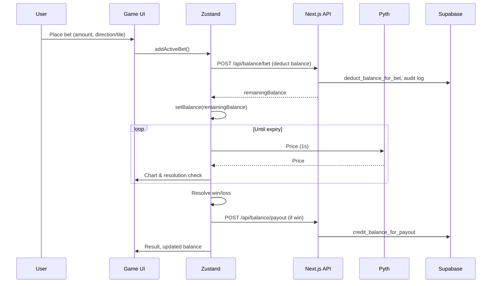
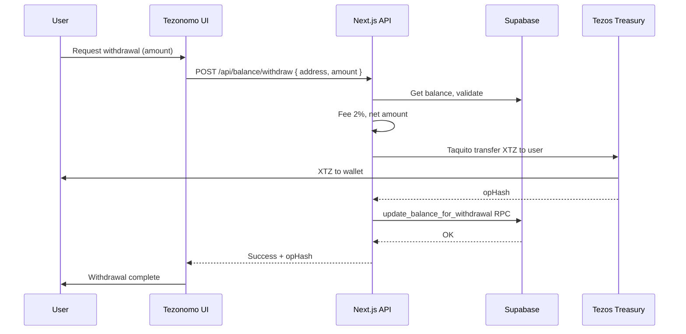

# Tezonomo

**Next-gen binary options trading on Tezos.**  
Trade XTZ with instant settlement, Pyth-backed resolution, and a single treasury — no per-bet transactions.
---

## Why Tezonomo?

Binary options in Web3 are rare; in Web2 they’re often opaque and unfair. Tezonomo fixes that:

- **Oracle-backed resolution** — Pyth Network drives real-time price attestations so wins and losses are provable.
- **Tezos-native** — Deposit and withdraw XTZ via Temple Wallet (Beacon); treasury and flows are on Tezos.
- **No per-bet signing** — House balance (Supabase) lets you place and resolve bets instantly; you only sign for deposit/withdraw.
- **Rich markets** — Crypto (BTC, XTZ, ETH, …), stocks (NVDA, TSLA), metals (Gold, Silver), forex (EUR, GBP, JPY) via Pyth.

*Like a modern “Binomo” experience — on Tezos, with oracle-backed resolution and minimal trust.*

---

## What You Get

- **Real-time resolution** — Pyth-powered prices; rounds resolve in seconds.
- **20+ markets** — Crypto, stocks, metals, forex (Pyth feeds).
- **Bet without signing every tx** — Off-chain house balance; deposit/withdraw on Tezos when you choose.
- **Two modes** — **Classic**: UP/DOWN + expiry (e.g. 5s–30s). **Box**: Tap tiles with multipliers; win when price touches your tile.
- **1–10x multipliers** (and Blitz), single XTZ treasury.
- **Instant settlement** — Off-chain engine + oracle-bound resolution; balance updates immediately.

---

## How It Works

1. **Connect & fund** — Connect **Temple Wallet** (Beacon), deposit XTZ into your Tezonomo house balance (on-chain transfer to treasury).
2. **Choose mode & place bet** — Pick amount, then **Classic** (UP/DOWN + expiry) or **Box** (multiplier tiles on the chart).
3. **Resolution** — Pyth price at expiry (or when price hits your tile in Box mode) determines win/loss. House balance updates instantly.
4. **Withdraw** — Request withdrawal; treasury sends XTZ to your Tezos address (minus a small fee). Confirmation on Tezos (Protocol 024–compatible gas limits).

---

## System Architecture

Hybrid: **on-chain treasury (Tezos)** + **off-chain game engine + oracle (Pyth)** + **off-chain state (Supabase)**.

### High-level



### Deposit flow



### Bet lifecycle



### Withdrawal flow



- **Tezos** — Deposits (wallet → treasury), withdrawals (treasury → wallet); native XTZ; Taquito + Beacon; Protocol 024 (PtTALLIN) compatible gas limits.
- **Pyth Network** — Real-time prices for resolution (crypto, stocks, FX, metals).
- **Supabase** — House balances (`user_balances` by address + currency XTZ), bet history, audit trail.

---

## Tech Stack

| Layer        | Stack |
|-------------|--------|
| **Frontend** | Next.js 16 (App Router), React 19, TypeScript, Tailwind CSS, Zustand, Framer Motion |
| **Blockchain** | Tezos (mainnet / Ghostnet), Temple Wallet (Beacon), Taquito, XTZ |
| **Oracle** | Pyth Network — 20+ feeds |
| **Backend** | Next.js API Routes, Supabase (PostgreSQL, RPCs) |
| **Payments** | Tezos treasury (on-chain XTZ), house balance (Supabase) |

---

## Tezos alignment


- **Tezos-native** — All value flow (deposit/withdraw) is XTZ on Tezos; wallet integration via Beacon (Temple); backend uses Taquito for treasury operations.
- **Real-time, consumer-facing** — Live charts, instant bet placement and resolution, and balance updates; fits **Gaming & Consumer Applications**.
- **Financial infrastructure** — House balance, treasury, and fee model are a small-scale payment/credits layer on Tezos.

- **Gaming & Consumer Applications** — Tezonomo is an interactive binary options dApp: users connect wallet, deposit XTZ, place bets, and withdraw — all with a consumer-grade UX and real-time data.

### Repo alignment

- **Tezos:** `@taquito/taquito`, `@taquito/beacon-wallet`, `@taquito/signer`; `lib/tezos/` (client, wallet, backend-client) for balance, deposit, and treasury withdrawals.
- **Wallet:** Beacon (Temple); connect/disconnect and signing in `lib/tezos/wallet.ts`.
- **Config:** `NEXT_PUBLIC_TEZOS_RPC_URL`, `NEXT_PUBLIC_TEZOS_TREASURY_ADDRESS`, `TEZOS_TREASURY_SECRET_KEY` in `.env`.

---

## Prerequisites

- **Node.js 18+** and npm or yarn
- **Temple Wallet** (or another Beacon-compatible Tezos wallet)
- **Tezos** — Mainnet or Ghostnet XTZ (e.g. [Ghostnet faucet](https://faucet.ghostnet.tezos.com/))

---

## Getting Started

### 1. Install

```bash
yarn install
# or: npm install
```

### 2. Environment

Copy `.env.example` to `.env` and set:

```bash
# Tezonomo Application Configuration
NEXT_PUBLIC_APP_NAME=Tezonomo
NEXT_PUBLIC_ROUND_DURATION=30
NEXT_PUBLIC_PRICE_UPDATE_INTERVAL=1000
NEXT_PUBLIC_CHART_TIME_WINDOW=300000

# Supabase Configuration
NEXT_PUBLIC_SUPABASE_URL=your-project-url
NEXT_PUBLIC_SUPABASE_ANON_KEY=your-anon-key
SUPABASE_SERVICE_ROLE_KEY=your-service-role-key

# Tezos Blockchain Configuration
# Mainnet or Ghostnet for testing (e.g. https://ghostnet.ecadinfra.com)
NEXT_PUBLIC_TEZOS_RPC_URL=https://mainnet.ecadinfra.com
NEXT_PUBLIC_TEZOS_TREASURY_ADDRESS=your-treasury-address
TEZOS_TREASURY_SECRET_KEY=your-treasury-secret-key

# Optional: WalletConnect (If using specific Beacon features)
NEXT_PUBLIC_WALLETCONNECT_PROJECT_ID=your-project-id
```

### 3. Database

In the Supabase SQL Editor, run the migrations in `supabase/migrations/` in order (e.g. `001_*` through `008_*`). This creates `user_balances` (with currency, e.g. XTZ), `balance_audit_log`, and procedures such as `deduct_balance_for_bet`, `credit_balance_for_payout`, `update_balance_for_withdrawal`.

### 4. Run

```bash
yarn dev
# or: npm run dev
```

Open [http://localhost:3000](http://localhost:3000). Connect Temple Wallet, deposit XTZ, and place bets.

---

## Database (summary)

- **user_balances** — House balance per user (Tezos address) and currency (XTZ); used for deposits, bets, and withdrawals.
- **balance_audit_log** — Audit trail: deposit, withdrawal, bet_placed, bet_won, etc.

---

## Troubleshooting

- **Wallet not connecting** — Install/unlock Temple (or Beacon-compatible wallet); ensure app and wallet use the same network (mainnet or Ghostnet).
- **Balance not loading** — Ensure Supabase env vars and migrations are correct; GET `/api/balance/[address]?currency=XTZ` returns `balance` and `tier`.
- **Withdrawal gas errors** — Backend uses explicit gas limits for Protocol 024 (PtTALLIN); if you see gas errors, check `lib/tezos/backend-client.ts` and RPC URL (mainnet vs Ghostnet).

---

## Resources

- [Tezos](https://tezos.com/)
- [Taquito](https://tequito.io/)
- [Beacon (Temple)](https://wallet.templewallet.com/)
- [Pyth Network](https://pyth.network/)
