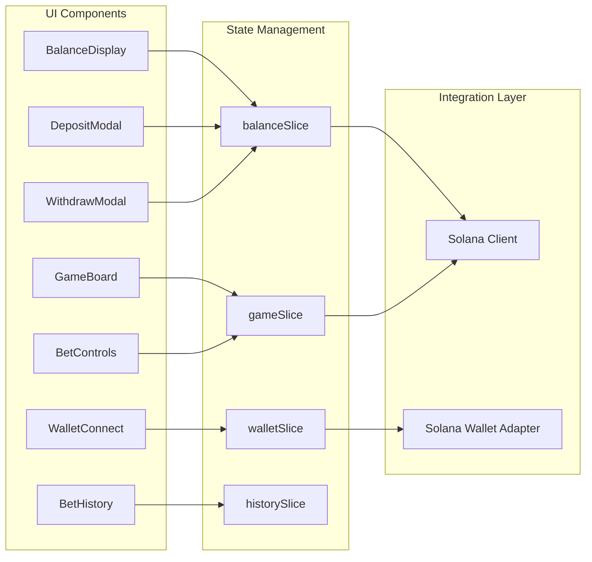

# SOLNOMO - Solana BTC Price Prediction Game

SOLNOMO is a decentralized real-time BTC price prediction game built on the Solana Blockchain. Users deposit SOL tokens to their house balance and place bets on Bitcoin price movements within 30-second rounds. The system combines secure on-chain treasury management with ultra-fast off-chain game logic for an optimal performance and user experience.

## Core Features

- Real-time BTC price prediction with 30-second rounds
- SOL-based betting system on Solana Devnet/Testnet
- Secure treasury wallet system for deposit/withdrawal operations
- Off-chain game logic for instant bet placement and settlement
- Live price chart with historical data visualization (BTC/USD)
- Multiple betting targets with configurable multipliers (up to 10x)
- Comprehensive audit logging for all balance operations
- Real-time balance synchronization between blockchain transactions and database

## System Architecture

The application follows a hybrid architecture combining on-chain treasury operations with off-chain game logic. This design optimizes for security (deposits/withdrawals on-chain) and performance (game logic off-chain).

### High-Level Architecture

```mermaid
graph TB
    subgraph "Client Layer"
        UI[React Components]
        Store[Zustand State]
        Hooks[Custom Hooks]
    end
    
    subgraph "Wallet Integration"
        SolanaAdapter[@solana/wallet-adapter-react]
        WalletAdapters[Phantom/Solflare Adapters]
    end
    
    subgraph "Blockchain Layer"
        SolanaSDK[@solana/web3.js]
        Treasury[Treasury Wallet]
        SOL[SOL Native Token]
        Transactions[Solana Transactions]
    end
    
    subgraph "API Layer"
        BalanceAPI[Balance API]
        GameAPI[Game API]
        Verification[Transaction Verification]
    end
    
    subgraph "Data Layer"
        Supabase[(Supabase PostgreSQL)]
        PriceAPI[Price Feed API / Pyth]
    end
    
    UI --> Store
    UI --> Hooks
    Hooks --> SolanaAdapter
    SolanaAdapter --> WalletAdapters
    SolanaAdapter --> SolanaSDK
    
    SolanaSDK --> Treasury
    Treasury --> SOL
    Treasury --> Transactions
    
    Store --> BalanceAPI
    Store --> GameAPI
    
    BalanceAPI --> Supabase
    GameAPI --> Supabase
    GameAPI --> PriceAPI
    
    Verification --> Transactions
    Verification --> Supabase
```

### Component Architecture



## Technical Stack

### Frontend
- **Next.js 14**: React framework with App Router
- **TypeScript**: Type-safe development
- **Tailwind CSS**: Utility-first CSS framework
- **Zustand**: Lightweight state management
- **Recharts**: Price visualization
- **@solana/wallet-adapter-react**: Official Solana wallet integration

### Blockchain
- **Solana Blockchain**: High-performance Layer 1 blockchain
- **@solana/web3.js**: TypeScript SDK for Solana interactions
- **SOL**: Native currency for deposits and betting
- **Pyth Network**: Real-time price oracle integration

### Backend
- **Next.js API Routes**: Serverless API endpoints for game logic
- **Supabase**: PostgreSQL database with real-time subscriptions
- **Solana Connection**: Direct RPC interaction for balance checks and transaction confirmation

## Prerequisites

- Node.js 18+ and npm
- A Solana wallet (Phantom, Solflare, etc.) for testing
- Solana Devnet/Testnet SOL tokens (get from [Solana Faucet](https://faucet.solana.com/))

## Getting Started

### 1. Install Dependencies

```bash
npm install
```

### 2. Set Up Environment Variables

Copy the example environment file and configure it:

```bash
cp .env.example .env
```

**Required Environment Variables:**
- `NEXT_PUBLIC_SOLANA_NETWORK`: Network (devnet, testnet, mainnet-beta)
- `NEXT_PUBLIC_SOLANA_RPC_ENDPOINT`: Solana RPC URL
- `NEXT_PUBLIC_TREASURY_ADDRESS`: Solana Public Key of the treasury wallet
- `SOLANA_TREASURY_SECRET_KEY`: Private Key (Base58 or JSON) for withdrawal processing
- `NEXT_PUBLIC_SUPABASE_URL`: Your Supabase project URL
- `NEXT_PUBLIC_SUPABASE_ANON_KEY`: Your Supabase anonymous key

### 3. Set Up Supabase Database

1. Create a project at [supabase.com](https://supabase.com)
2. Run the SQL migrations found in `supabase/migrations/` in the Supabase SQL Editor.

### 4. Start the Development Server

```bash
npm run dev
```

Open [http://localhost:3000](http://localhost:3000) in your browser.

## Database Schema

### Table Definitions

#### user_balances
Stores the current house balance for each user address.

| Column | Type | Description |
|--------|------|-------------|
| user_address | TEXT | Solana wallet address (Base58) |
| balance | NUMERIC(20,8) | Current SOL balance |
| updated_at | TIMESTAMP | Last update timestamp |

#### balance_audit_log
Audit trail for all balance operations.

| Column | Type | Description |
|--------|------|-------------|
| id | BIGSERIAL | Auto-incrementing ID |
| user_address | TEXT | Solana wallet address |
| operation_type | TEXT | deposit, withdrawal, bet_placed, bet_won |
| amount | NUMERIC(20,8) | Operation amount |
| transaction_hash | TEXT | Solana transaction signature |

## Game Mechanics

### Betting Targets
Multiple targets with multipliers based on price movement:

| Target | Price Movement | Multiplier |
|--------|---------------|------------|
| Target 1 | +0.1% to +0.3% | 2.5x |
| Target 2 | +0.3% to +0.5% | 5.0x |
| Target 3 | +0.5% to +1.0% | 10.0x |
| ... | Downward targets | ... |

### House Balance System
The house balance system enables fast bet placement without blockchain transactions:

1. User deposits SOL to treasury (on-chain transaction)
2. UI confirms transaction and updates house balance (off-chain)
3. User places bets instantly using house balance (off-chain)
4. Winnings credited instantly to house balance (off-chain)
5. User withdraws SOL to wallet (on-chain via treasury)

## Troubleshooting

### Wallet Connection Issues
- Ensure wallet is on the same network as the app (Devnet/Testnet).
- Check that you have SOL for gas fees.
- Refresh the page to re-initialize the Solana provider.

### Balance Mismatch
- Transactions on Solana may take a few seconds to reach 'confirmed' status.
- Verify the transaction signature on [Solana Explorer](https://explorer.solana.com/?cluster=devnet).

## License

MIT License

## Resources

- [Solana Documentation](https://docs.solana.com/)
- [Solana Web3.js SDK](https://solana-labs.github.io/solana-web3.js/)
- [Next.js Documentation](https://nextjs.org/docs)
- [Supabase Documentation](https://supabase.com/docs)
